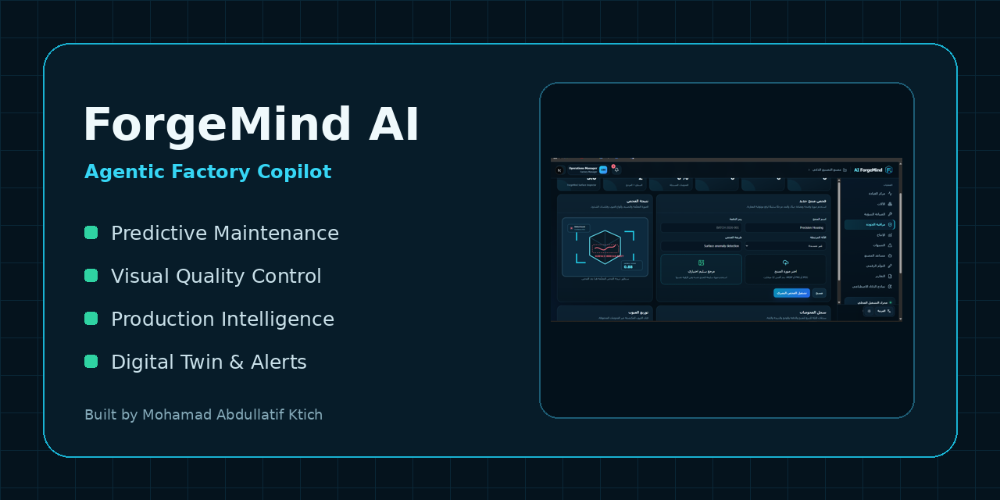

  
  <h1>ForgeMind AI</h1>
  
<strong>مساعد ذكي للمصانع يجمع الصيانة التنبؤية، فحص الجودة البصري، مراقبة الإنتاج، التنبيهات والتقارير في منصة واحدة.</strong>

  
<a href="README.md">English README</a>

## نبذة

ForgeMind AI منصة صناعية متكاملة تعمل محليًا باستخدام Next.js وFastAPI، وتدعم الانتقال إلى PostgreSQL وSupabase. تستقبل قراءات الآلات، تحفظها، تحلل المخاطر والشذوذ، تنشئ التنبيهات وتوصيات الصيانة، وتوفر فحصًا بصريًا للمنتجات ومساعد مصنع عربيًا وإنجليزيًا.

## المزايا

- إدارة المصانع والآلات وسجل الحساسات والصيانة والإنتاج.
- Health Score وFailure Probability وAnomaly Score وتقدير RUL.
- فحص صور المنتجات، المقارنة بمرجع سليم، وتحديد مناطق الاشتباه.
- OEE والإنتاج والمنتجات المرفوضة ووقت التوقف.
- تنبيهات وأوامر صيانة وتقارير PDF وتصدير CSV.
- مساعد عمليات يعتمد على بيانات المنصة الفعلية.
- توأم رقمي وسيناريوهات أعطال من دون الحاجة إلى مصنع فعلي أثناء العرض.
- واجهة عربية RTL وإنجليزية، وثيم داكن وفاتح وتلقائي.
- API جاهز مستقبلًا لربط PLC وMQTT وOPC UA وبوابات الحساسات.

## حالة نماذج الذكاء الاصطناعي

النموذج العام المرفق يعمل محليًا لكنه مدرّب على بيانات Benchmark مولدة. يتضمن المشروع مسارات تدريب كاملة لـMetroPT-3 وKSDD، لكن الأوزان المدربة على البيانات الأصلية ليست مرفقة. صفحة **AI Models** تعرض حالة كل نموذج ومصدره ومقاييسه وقيوده بوضوح.

## التشغيل السريع

1. ثبّت Python 3.11+ وNode.js 22+.
2. شغّل `SETUP_WINDOWS.bat` مرة واحدة.
3. شغّل `START_FORGEMIND.bat`.
4. افتح `http://localhost:3000`.

راجع [دليل التشغيل العربي](docs/QUICK_START_AR.md) و[إعداد Supabase](docs/SUPABASE_SETUP.md).

## الحقوق

تصميم وتطوير: **[Mohamad Abdullatif Ktich](https://www.linkedin.com/in/mohamad-ktich)**
GitHub: [github.com/MohamadKtich](https://github.com/MohamadKtich)
البريد: [ktichmohamad@gmail.com](mailto:ktichmohamad@gmail.com)

Copyright © 2026 Mohamad Abdullatif Ktich. المشروع منشور وفق رخصة [MIT](LICENSE).
