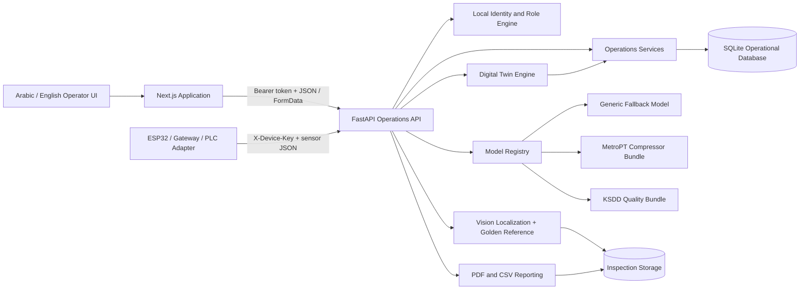

# ForgeMind AI 3.0 Architecture



## Frontend

- Next.js App Router, React, and TypeScript strict mode.
- Arabic and English with document-level `lang` and `dir` updates.
- RTL-aware navigation, tables, forms, modals, charts, and mobile sidebar.
- Light, Dark, and System theme persisted in browser storage.
- Recharts visualizations and shared UI components.
- Route protection through middleware and backend identity verification.
- Original local SVG identity assets, with no dependency on remote image hosts.

## Backend

- FastAPI and generated OpenAPI documentation.
- Pydantic validation and SQLAlchemy ORM.
- SQLite with foreign keys and WAL mode.
- Signed bearer tokens, PBKDF2 password hashes, and role dependencies.
- Services for predictive maintenance, quality inspection, simulation, reporting, assistant analysis, and ingestion.
- Audit records for identity, administration, and operations.

## Predictive selection

```text
Sensor reading
  → validation and persistence
  → inspect machine family
  → compressor/APU: MetroPT bundle when installed
  → other machines or missing specialized bundle: explicit generic fallback
  → classifier probability + anomaly score + engineering conditions
  → health / risk / RUL / likely issue / explanation
  → machine status update
  → alert when thresholds are crossed
```

The model registry never labels a missing bundle as trained. This is apparently a noteworthy feature in a world where a gradient icon can become “AI” by executive decree.

## Quality flow

```text
Product image
  → MIME, size, and dimension validation
  → normalization
  → KSDD classifier probability when installed
  → surface localization or golden-reference difference mask
  → contour and geometry analysis
  → defect category, confidence, and bounding boxes
  → annotated image
  → inspection record and analytics
```

## Local persistence

SQLite is used to complete the application before external infrastructure. Images, report PDFs, and model bundles are stored locally. The API and repository boundaries allow a later PostgreSQL/Supabase and object-storage migration without replacing the product workflows.

## Security boundary

The browser never receives password hashes, the database, application secret, or device key. Human routes use bearer sessions and backend role checks. Hardware ingestion uses a separate key. Public deployment still requires HTTPS, production secrets, backups, monitoring, network controls, and a safety review before real equipment commands.
